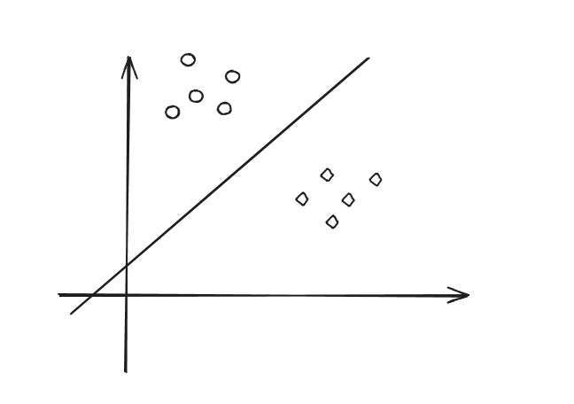
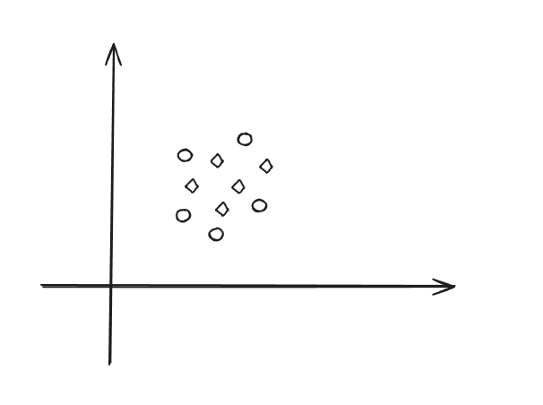
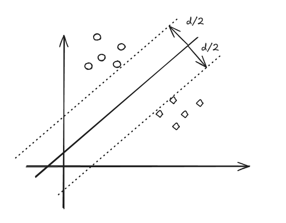

# 目录

[toc]

# 0. 没有免费午餐定理 No Free Lunch Theorem

如果我们不对特征空间有先验假设，则所有算法的平均表现是一样的

# 1. 支持向量机 Support Vector Machine

## 1.1. 支持向量机（线性模型）

### 1.1.1. 支持向量机（线性模型）问题

**线性模型的定义**：使用一条直线可以将数据集按照各自的种类进行分开，该条直线就是线性模型；能够被线性模型分开的数据集也称为线性可分数据集；反之，无法被线性模型分开的数据集也就称为非线性可分数据集.





若存在一条直线可以将数据集分开，那么在空间中一定会存在无数条直线可以将数据集分开。那么就存在一个问题，哪条直线是最好的？若需要获得最好的直线，就需要为每条线定义统一的性能指标。

**性能指标**：将直线往上、往下都进行平移，直到直线触碰到数据集中的元素，会得到两条直线的距离
**最好的直线**：就是将平移距离最大且是居中的那条直线



### 1.1.2. 支持向量机（线性模型）数学描述

**d**: 称为间隔 Margin
将平行线插到的向量称为支持向量 Support Vector
**定义：**

---

- 训练数据及标签：（$X_1, y_1$），（$X_2, y_2$），（$X_3, y_3$）...，（$X_N, y_N$）；其中 $X_N$ 都为向量，向量的维度基本上都是 >=2 的，$y_N$ 为标签，只有两个值，在支持向量机中为了方便计算，$y$ 暂定为1和-1

- 线性模型：待定的参数 $(W, b)$, 其中 $W$ 为向量, $b$ 为常数, 超平面的线性方程：$W^T*X + b = 0$, 若 $X_N$ 向量的维度是 $[X_11, X_12, X_13, ... , X_1N]$, 那么 $W$ 向量的维度与 $X$ 向量的维度一样，且 $W^T*X$ 会计算得到一个常数数值，目的是根据数据集计算出参数 $(W, b)$

- 线性可分的定义：一个训练集$\displaystyle \left\{(X_i, y_i) \right\}_{i=1-N}$，$\exist(W, b)$ 使得对 $\forall {i=1-N} $
    $$
    \begin{cases}
    若y_i=+1, 则W^T*X_i + b >= 0;\\
    若y_i=-1, 则W^T*X_i + b < 0;
    \end{cases}
    $$

可以将上述的公式简化为
$y_i[W^T*X_i + b] >= 0$

### 1.1.3. 支持向量机（线性模型）优化问题

最小化（Minimize）：$||W||^2$
限制条件（Subject to）：$y_i[W^T*X_i + b] >= 1$，且 i=1~N

---

**事实1**：$W^T *X + b = 0$ 和 $aW^T *X + ab = 0$在同一个平面上，且 a 为正实数
**事实2**：点到直线的距离公式，若平面为：$w_1*x + w_2*y + b = 0$，则$（x_0, y_0）$到平面的距离为 $d = \displaystyle\frac{|w_1*x0 + w_2*y0 + b|}{\sqrt{w_1^2 + w_2^2}}$，由此可以推到出向量 $X_0$ 到超平面 $W^T*X + b$ 的距离公式为 $d = \displaystyle\frac{|W^T*X_0 + b|}{{||W||}}$，其中 ||W|| 为 $\sqrt{w_1^2 + w_2^2 + w_3^2 + ... + w_n^2}$

---

在上述事实的基础上，我们对于可以用 a 来缩放，使得支持向量 $X_0$, 在 $|W^T*X_0 + b| = 1$，那么支持向量到超平面的距离公式就演变为了$d = \displaystyle\frac{1}{{||W||}}$，为了最大化 d，也就是为了最小化 $||W||$， 也就是最小化 $||W||^2$，在周志华的《机器学习》书中，写成了 $\displaystyle\frac{1}{{2}}||W||^2$，是为了更好的求导计算

### 1.1.4. 支持向量机（线性模型）代码实现

逻辑实现：

```python
"""使用 numpy 从零实现线性支持向量机（SVM）。

这份代码刻意保持为“容易读懂”的版本：
1. 只处理二分类问题。
2. 只使用 numpy，不依赖 sklearn。
3. 使用软间隔 SVM 的常见目标函数：
   0.5 * ||w||^2 + C * mean(max(0, 1 - y * (w^T x + b)))
4. 用批量梯度下降优化，方便理解每一步在做什么。

如果你是机器学习初学者，可以先把注意力放在三个核心方法上：
- fit: 训练模型，学习参数 w 和 b
- decision_function: 计算每个样本距离分隔超平面的“方向和远近”
- predict: 根据 decision_function 的结果给出类别预测
"""

from __future__ import annotations

from dataclasses import dataclass, field

import matplotlib.pyplot as plt
import numpy as np


def _configure_matplotlib_for_chinese() -> None:
	"""为中文标题和坐标轴提供常见字体回退。"""
	plt.rcParams["font.sans-serif"] = [
		"Microsoft YaHei",
		"SimHei",
		"Noto Sans CJK SC",
		"WenQuanYi Zen Hei",
		"Arial Unicode MS",
		"DejaVu Sans",
	]
	plt.rcParams["axes.unicode_minus"] = False


_configure_matplotlib_for_chinese()


@dataclass
class LinearSVM:
	"""使用批量梯度下降训练的线性二分类 SVM。

	参数说明
	----------
	learning_rate:
		每次参数更新迈出的步长。值越大，学习越快，但也更容易震荡。
	regularization_strength:
		软间隔 SVM 里的 C。值越大，越重视把训练样本分对。
	epochs:
		整个训练集重复学习多少轮。
	support_vector_tolerance:
		判断一个样本是否“贴近间隔边界”的容差。
	"""

	learning_rate: float = 0.05
	regularization_strength: float = 1.0
	epochs: int = 2000
	support_vector_tolerance: float = 0.05
	weights_: np.ndarray | None = field(init=False, default=None)
	bias_: float = field(init=False, default=0.0)
	classes_: np.ndarray | None = field(init=False, default=None)
	loss_history_: list[float] = field(init=False, default_factory=list)
	margin_violation_history_: list[int] = field(init=False, default_factory=list)
	support_vector_indices_: np.ndarray = field(init=False, default_factory=lambda: np.array([], dtype=int))
	support_vectors_: np.ndarray = field(init=False, default_factory=lambda: np.empty((0, 0), dtype=float))

	def fit(self, features: np.ndarray, labels: np.ndarray) -> "LinearSVM":
		"""训练模型。"""
		x = self._validate_features(features)
		y = self._encode_labels(labels)

		sample_count, feature_count = x.shape
		self.weights_ = np.zeros(feature_count, dtype=float)
		self.bias_ = 0.0
		self.loss_history_ = []
		self.margin_violation_history_ = []

		for _ in range(self.epochs):
			margins = y * (x @ self.weights_ + self.bias_)
			active = margins < 1.0

			gradient_w = self.weights_.copy()
			gradient_b = 0.0

			if np.any(active):
				gradient_w -= (
					self.regularization_strength
					* (x[active].T @ y[active])
					/ sample_count
				)
				gradient_b -= (
					self.regularization_strength
					* np.sum(y[active])
					/ sample_count
				)

			self.weights_ -= self.learning_rate * gradient_w
			self.bias_ -= self.learning_rate * gradient_b

			updated_margins = y * (x @ self.weights_ + self.bias_)
			loss = self._objective(x, y, updated_margins)
			self.loss_history_.append(loss)
			self.margin_violation_history_.append(int(np.sum(updated_margins < 1.0)))

		self._identify_support_vectors(x, y)
		return self

	def decision_function(self, features: np.ndarray) -> np.ndarray:
		"""计算样本到分隔超平面的有符号距离分数。"""
		self._check_is_fitted()
		x = self._validate_features(features)
		return x @ self.weights_ + self.bias_

	def predict(self, features: np.ndarray) -> np.ndarray:
		"""根据分数正负返回原始标签。"""
		scores = self.decision_function(features)
		signed_labels = np.where(scores >= 0.0, 1, -1)
		return np.where(signed_labels == 1, self.classes_[1], self.classes_[0])

	def score(self, features: np.ndarray, labels: np.ndarray) -> float:
		"""返回分类准确率。"""
		predictions = self.predict(features)
		y = np.asarray(labels)
		if y.ndim != 1:
			raise ValueError("labels 必须是一维数组。")
		if len(predictions) != len(y):
			raise ValueError("features 和 labels 的样本数量必须一致。")
		return float(np.mean(predictions == y))

	def plot_2d_decision_boundary(
		self,
		features: np.ndarray,
		labels: np.ndarray,
		ax=None,
		grid_points: int = 300,
		padding: float = 0.8,
		title: str = "线性 SVM 二维决策边界",
	):
		"""绘制二维数据上的决策边界、间隔线和支持向量。

		为什么这个图对初学者有帮助：
		- 实线表示模型学到的分隔超平面。
		- 两条虚线表示 margin，也就是 SVM 希望尽量拉大的“安全距离”。
		- 被黑色空心圆圈出的点就是支持向量，它们最直接地决定了边界位置。
		"""
		self._check_is_fitted()
		x = self._validate_features(features)
		y = np.asarray(labels)

		if x.shape[1] != 2:
			raise ValueError("plot_2d_decision_boundary 只支持两个特征的二维数据。")
		if y.ndim != 1:
			raise ValueError("labels 必须是一维数组。")
		if len(x) != len(y):
			raise ValueError("features 和 labels 的样本数量必须一致。")

		if ax is None:
			fig, ax = plt.subplots(figsize=(8, 6))
		else:
			fig = ax.figure

		x_min, x_max = x[:, 0].min() - padding, x[:, 0].max() + padding
		y_min, y_max = x[:, 1].min() - padding, x[:, 1].max() + padding
		xx, yy = np.meshgrid(
			np.linspace(x_min, x_max, grid_points),
			np.linspace(y_min, y_max, grid_points),
		)
		grid = np.c_[xx.ravel(), yy.ravel()]
		scores = self.decision_function(grid).reshape(xx.shape)

		ax.contourf(
			xx,
			yy,
			scores,
			levels=[-1e9, 0.0, 1e9],
			colors=["#d6eaf8", "#fdebd0"],
			alpha=0.7,
		)
		ax.contour(
			xx,
			yy,
			scores,
			levels=[-1.0, 0.0, 1.0],
			colors=["#5d6d7e", "#17202a", "#5d6d7e"],
			linestyles=["--", "-", "--"],
			linewidths=[1.5, 2.5, 1.5],
		)

		class_colors = ["#2874a6", "#d35400"]
		for index, class_label in enumerate(self.classes_):
			mask = y == class_label
			ax.scatter(
				x[mask, 0],
				x[mask, 1],
				label=f"类别 {class_label}",
				color=class_colors[index],
				s=70,
				edgecolors="white",
				linewidths=1.0,
			)

		ax.scatter(
			self.support_vectors_[:, 0],
			self.support_vectors_[:, 1],
			label="支持向量",
			facecolors="none",
			edgecolors="black",
			s=220,
			linewidths=1.8,
		)

		ax.set_title(title)
		ax.set_xlabel("特征 1")
		ax.set_ylabel("特征 2")
		ax.legend(loc="best")
		ax.grid(alpha=0.18)
		return fig, ax

	def _objective(self, x: np.ndarray, y: np.ndarray, margins: np.ndarray) -> float:
		hinge_loss = np.maximum(0.0, 1.0 - margins)
		regularization = 0.5 * float(np.dot(self.weights_, self.weights_))
		data_loss = self.regularization_strength * float(np.mean(hinge_loss))
		return regularization + data_loss

	def _identify_support_vectors(self, x: np.ndarray, y: np.ndarray) -> None:
		margins = y * (x @ self.weights_ + self.bias_)
		near_boundary = np.abs(margins - 1.0) <= self.support_vector_tolerance
		inside_margin = margins < 1.0 + self.support_vector_tolerance
		indices = np.flatnonzero(near_boundary | inside_margin)

		if indices.size < 2:
			positive_index = int(np.argmin(np.where(y == 1.0, np.abs(margins - 1.0), np.inf)))
			negative_index = int(np.argmin(np.where(y == -1.0, np.abs(margins - 1.0), np.inf)))
			indices = np.unique(np.concatenate([indices, np.array([positive_index, negative_index], dtype=int)]))

		self.support_vector_indices_ = indices.astype(int)
		self.support_vectors_ = x[self.support_vector_indices_]

	def _encode_labels(self, labels: np.ndarray) -> np.ndarray:
		y = np.asarray(labels)
		if y.ndim != 1:
			raise ValueError("labels 必须是一维数组。")

		unique_labels = np.unique(y)
		if unique_labels.size != 2:
			raise ValueError("LinearSVM 只支持二分类标签。")

		self.classes_ = unique_labels
		negative_label, positive_label = unique_labels[0], unique_labels[1]
		return np.where(y == positive_label, 1.0, -1.0)

	@staticmethod
	def _validate_features(features: np.ndarray) -> np.ndarray:
		x = np.asarray(features, dtype=float)
		if x.ndim != 2:
			raise ValueError("features 必须是二维数组，形状应为 (样本数, 特征数)。")
		if x.shape[0] == 0:
			raise ValueError("features 不能为空。")
		return x

	def _check_is_fitted(self) -> None:
		if self.weights_ is None or self.classes_ is None:
			raise ValueError("模型还没有训练，请先调用 fit。")


def demo(show_plot: bool = True, save_plot_path: str | None = None) -> None:
	"""用一个简单数据集演示训练、预测和二维可视化流程。"""
	features = np.array(
		[
			[2.0, 3.0],
			[3.0, 3.2],
			[2.5, 2.7],
			[2.7, 1.8],
			[-2.0, -1.0],
			[-3.0, -2.5],
			[-2.2, -2.8],
			[-1.8, -2.3],
		],
		dtype=float,
	)
	labels = np.array([1, 1, 1, 1, 0, 0, 0, 0])

	model = LinearSVM(learning_rate=0.05, regularization_strength=1.5, epochs=2500)
	model.fit(features, labels)

	print("训练完成")
	print("权重 w:", model.weights_)
	print("偏置 b:", model.bias_)
	print("训练集准确率:", model.score(features, labels))
	print("支持向量索引:", model.support_vector_indices_)

	new_points = np.array([[2.2, 2.4], [-2.5, -1.8], [0.2, 0.3]], dtype=float)
	print("新样本预测:", model.predict(new_points))
	print("新样本分数:", model.decision_function(new_points))

	fig, _ = model.plot_2d_decision_boundary(
		features,
		labels,
		title="线性 SVM 二维决策边界与支持向量",
	)
	if save_plot_path is not None:
		fig.savefig(save_plot_path, dpi=160, bbox_inches="tight")
		print("图像已保存到:", save_plot_path)
	if show_plot:
		plt.show()
	else:
		plt.close(fig)


if __name__ == "__main__":
	demo()

```

测试用例：

```python
import importlib.util
import sys
import unittest
from pathlib import Path

import matplotlib
import numpy as np


matplotlib.use("Agg")


MODULE_PATH = Path(__file__).resolve().parents[1] / "支持向量机（线性模型）.py"
SPEC = importlib.util.spec_from_file_location("linear_svm_module", MODULE_PATH)
MODULE = importlib.util.module_from_spec(SPEC)
assert SPEC.loader is not None
sys.modules[SPEC.name] = MODULE
SPEC.loader.exec_module(MODULE)
LinearSVM = MODULE.LinearSVM


class LinearSVMTestCase(unittest.TestCase):
    def setUp(self):
        self.features = np.array(
            [
                [2.0, 3.0],
                [3.0, 3.2],
                [2.5, 2.7],
                [2.7, 1.8],
                [-2.0, -1.0],
                [-3.0, -2.5],
                [-2.2, -2.8],
                [-1.8, -2.3],
            ],
            dtype=float,
        )
        self.binary_labels = np.array([1, 1, 1, 1, 0, 0, 0, 0])
        self.pm_one_labels = np.array([1, 1, 1, 1, -1, -1, -1, -1])
        self.model = LinearSVM(
            learning_rate=0.05,
            regularization_strength=1.5,
            epochs=3000,
            support_vector_tolerance=0.1,
        )

    def test_fit_can_separate_training_data(self):
        self.model.fit(self.features, self.binary_labels)

        predictions = self.model.predict(self.features)
        self.assertTrue(np.array_equal(predictions, self.binary_labels))
        self.assertAlmostEqual(self.model.score(self.features, self.binary_labels), 1.0)
        self.assertEqual(self.model.weights_.shape, (2,))

    def test_predict_can_classify_unseen_points(self):
        self.model.fit(self.features, self.binary_labels)

        new_points = np.array([[2.8, 2.5], [-2.4, -1.7], [1.8, 1.6], [-1.7, -2.0]])
        expected = np.array([1, 0, 1, 0])

        predictions = self.model.predict(new_points)
        self.assertTrue(np.array_equal(predictions, expected))

    def test_loss_decreases_after_training(self):
        self.model.fit(self.features, self.binary_labels)

        self.assertGreater(len(self.model.loss_history_), 10)
        self.assertLess(self.model.loss_history_[-1], self.model.loss_history_[0])
        self.assertLessEqual(self.model.margin_violation_history_[-1], self.model.margin_violation_history_[0])

    def test_support_vectors_are_recorded(self):
        self.model.fit(self.features, self.binary_labels)

        self.assertGreaterEqual(len(self.model.support_vector_indices_), 2)
        self.assertEqual(self.model.support_vectors_.shape[1], self.features.shape[1])
        self.assertTrue(np.all(self.model.support_vector_indices_ < len(self.features)))

    def test_negative_one_positive_one_labels_are_supported(self):
        self.model.fit(self.features, self.pm_one_labels)

        predictions = self.model.predict(self.features)
        self.assertTrue(np.array_equal(predictions, self.pm_one_labels))

    def test_invalid_multiclass_labels_raise_error(self):
        invalid_labels = np.array([0, 1, 2, 0, 1, 2, 0, 1])

        with self.assertRaises(ValueError):
            self.model.fit(self.features, invalid_labels)

    def test_plot_2d_decision_boundary_returns_figure_and_axis(self):
        self.model.fit(self.features, self.binary_labels)

        figure, axis = self.model.plot_2d_decision_boundary(self.features, self.binary_labels)

        self.assertIs(figure.axes[0], axis)
        self.assertEqual(axis.get_xlabel(), "特征 1")
        self.assertEqual(axis.get_ylabel(), "特征 2")
        self.assertEqual(axis.get_title(), "线性 SVM 二维决策边界")
        self.assertIsNotNone(axis.get_legend())
        figure.clf()

    def test_plot_2d_decision_boundary_requires_two_features(self):
        self.model.fit(self.features, self.binary_labels)
        three_dimensional_features = np.column_stack([self.features, np.ones(len(self.features))])

        with self.assertRaises(ValueError):
            self.model.plot_2d_decision_boundary(three_dimensional_features, self.binary_labels)

    def test_predict_before_fit_raises_error(self):
        with self.assertRaises(ValueError):
            self.model.predict(self.features)


if __name__ == "__main__":
    unittest.main()
```
